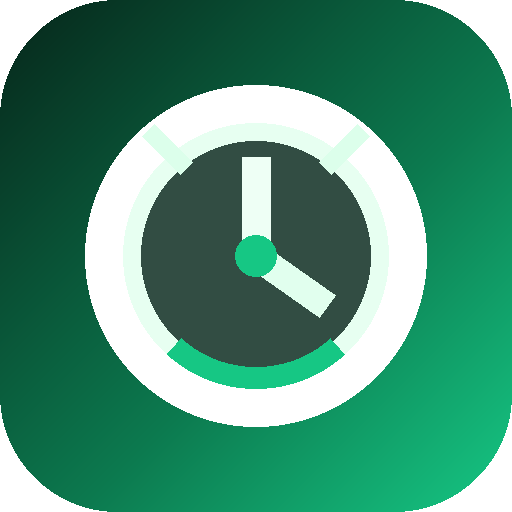
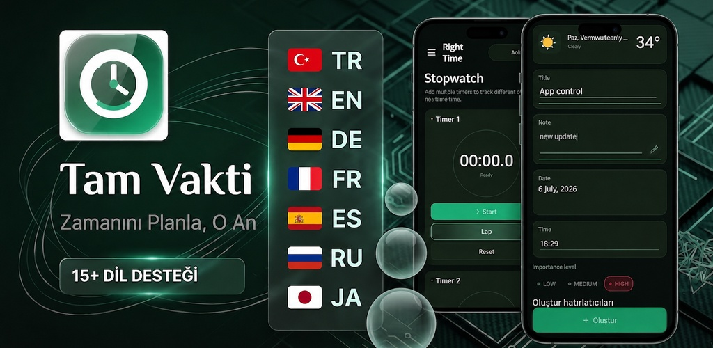
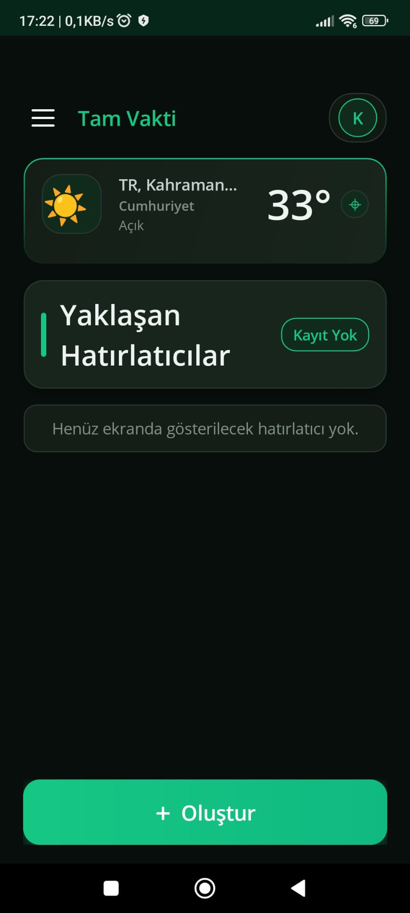
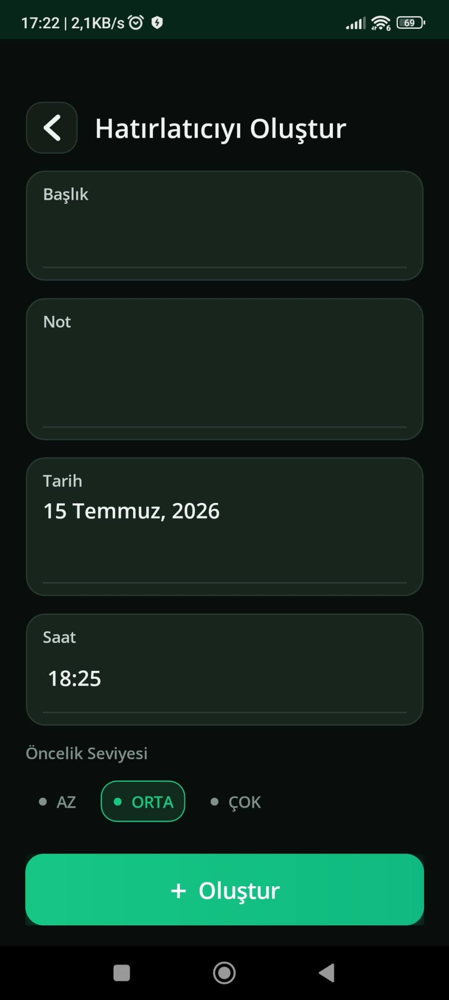
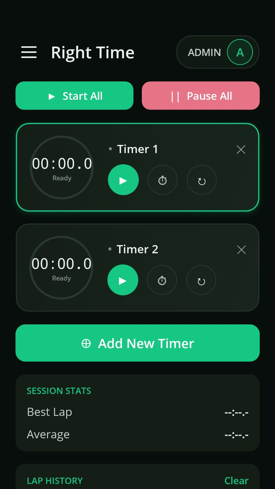
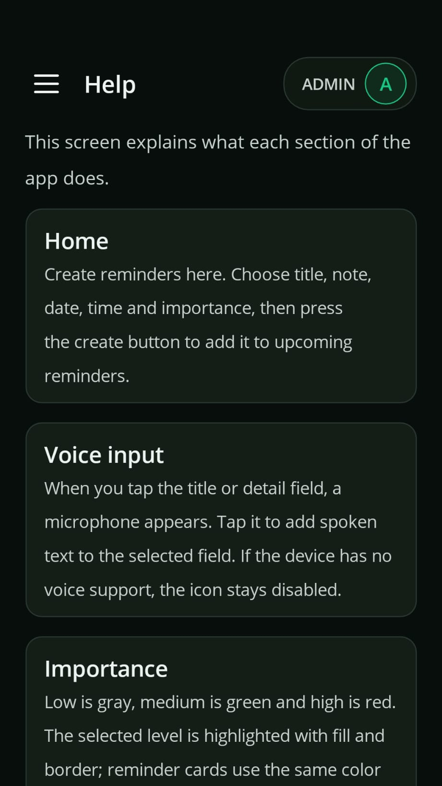
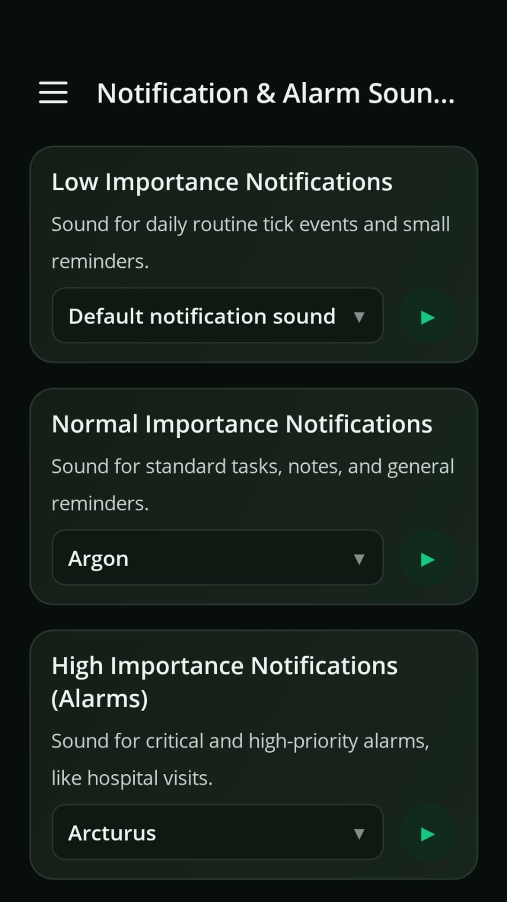
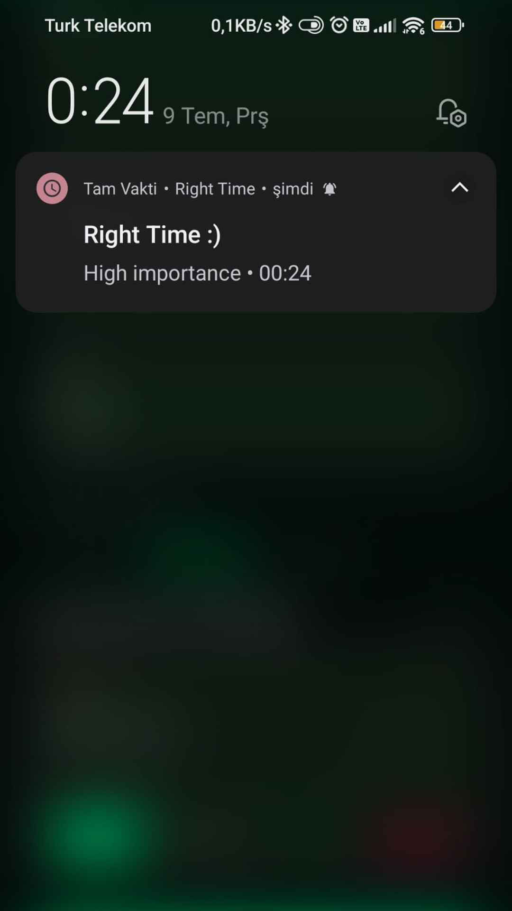

<div align="center">
  
  <h1>Tam Vakti</h1>
  <p><strong>Zamanını planla, o anı kaçırma.</strong></p>
  <p>Hatırlatıcı, alışkanlık takibi, hava durumu ve çoklu kronometreyi tek bir sade mobil deneyimde buluşturan üretkenlik uygulaması.</p>

  <p>
    <a href="https://play.google.com/store/apps/details?id=com.msds.tamvakti"></a>
  </p>

  <p>
    
    
    
    
  </p>
</div>



## Uygulama hakkında

Tam Vakti; günlük planları, önemli anları ve odak sürelerini tek yerde yönetmek için geliştirildi. Hatırlatıcılar önem seviyesine göre ayarlanabilir, sesle başlık girilebilir ve yaklaşan kayıtlar ana ekrandan hızlıca takip edilebilir. Uygulama açık/koyu tema ve çoklu dil desteğiyle farklı kullanım alışkanlıklarına uyum sağlar.

### Öne çıkan özellikler

- Tarih, saat, not ve önem seviyesiyle hatırlatıcı oluşturma
- Yerel Android alarm altyapısı ve ertelenebilir bildirimler
- Sesli giriş ile hızlı başlık ekleme
- Alışkanlık takibi ve tamamlanma durumu
- Tamamlanan kayıtlar için arşiv
- Aynı anda birden fazla sayaç çalıştırabilen kronometre
- Arka planda çalışmayı sürdüren Android kronometre servisi
- Konuma göre hava durumu ve manuel konum seçimi
- Bildirim/alarm sesi özelleştirme
- Açık ve koyu tema
- Türkçe dahil çoklu dil desteği

## Ekran görüntüleri

En son sürümde hatırlatıcı oluşturma akışı ana sayfadan ayrılarak daha sade ve odaklı bir ekrana taşındı.

<p align="center">
  
  
  
</p>

<p align="center">
  
  
  
</p>

## Kullanılan teknolojiler

| Alan | Teknoloji / yaklaşım |
| --- | --- |
| Uygulama çatısı | .NET 10, .NET MAUI Single Project |
| Dil ve arayüz | C#, XAML, MAUI Controls |
| Hedefler | Android; MAUI kod tabanında iOS, macOS ve Windows hedefleri |
| Mimari | Bağımlılık enjeksiyonu, servis arayüzleri, platforma özel uygulamalar |
| Android entegrasyonu | AlarmManager, BroadcastReceiver, Foreground Service, SpeechRecognizer |
| Cihaz özellikleri | Geolocation, Preferences, yerel bildirimler |
| Ağ | HttpClient tabanlı hava durumu ve konum servisleri |
| Yerelleştirme | Kültür bazlı çoklu dil altyapısı |
| Tasarım | Özel MAUI stilleri, açık/koyu tema, duyarlı mobil düzen |

## Mimari yaklaşım

Platformdan bağımsız ekran ve iş akışları .NET MAUI katmanında tutulur. Alarm, sesli giriş ve arka plan kronometresi gibi işletim sistemine bağlı özellikler arayüzler üzerinden ayrıştırılır ve Android tarafında yerel servislerle uygulanır. Bu yapı, ortak kodun test edilebilir kalmasını ve platform davranışlarının kontrollü biçimde genişletilmesini sağlar.

```text
UI (MAUI / XAML)
    ↓
Uygulama servisleri ve modeller
    ↓
Platform arayüzleri
    ↓
Android alarm, bildirim, ses ve arka plan servisleri
```

## Kod örnekleri

[`samples`](samples) klasörü; projedeki yaklaşımı göstermek için sadeleştirilmiş model, servis sözleşmesi ve XAML bileşeni örnekleri içerir. Bunlar üretim uygulamasının çekirdek algoritmaları veya tam kaynak kodu değildir.

```csharp
public interface IReminderScheduler
{
    Task ScheduleAsync(ReminderPreview reminder, CancellationToken cancellationToken = default);
    Task CancelAsync(string reminderId, CancellationToken cancellationToken = default);
}
```

## Kaynak kodu paylaşım politikası

Bu depo bir **ürün vitrini ve sınırlı kod örneği** deposudur; Tam Vakti'nin tam açık kaynak deposu değildir.

- Üretim kaynak kodu ve uygulamanın çekirdek iş mantığı burada yayımlanmaz.
- İmzalama anahtarları, API anahtarları, APK/AAB dosyaları ve yapı çıktıları depoya eklenmez.
- `samples/` altındaki kodlar bağımsız ve sadeleştirilmiş örneklerdir.
- Ekran görüntüleri ve marka varlıkları uygulamayı tanıtmak amacıyla sunulur.

## Gizlilik

Uygulamanın gizlilik yaklaşımı ve kullanılan izinlerle ilgili ayrıntılar için [Gizlilik Politikası](PRIVACY.md) belgesini inceleyebilirsiniz.

## Lisans

`samples/` klasöründeki örnek yazılım kodları [MIT Lisansı](LICENSE) ile sunulur. Tam Vakti adı, uygulama simgesi, ekran görüntüleri ve diğer marka/görsel varlıkları bu lisansın kapsamında değildir; ayrıntılar için [Varlık Kullanım Bildirimi](ASSETS_LICENSE.md) belgesine bakın.

---

<div align="center">
  <a href="https://play.google.com/store/apps/details?id=com.msds.tamvakti">Tam Vakti'ni Google Play'de görüntüle</a>
</div>
